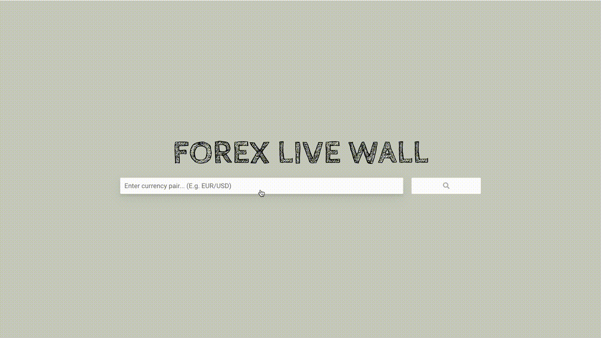

apexcharts
react-redux
redux toolkit
axios

# Simple Forex live wall application

After user inputs a query string and presses the search button, the applications fetches the latest data from server and displays information about currency pair and candlestick chart.

Data updating time frame could be changed by buttons at the top right of the wall.

## About

This project was bootstrapped with [Create React App](https://github.com/facebook/create-react-app).

Instal the project - `npm install`

In the project directory, you can run `npm start` to run app in development mode. 
Open [http://localhost:3000](http://localhost:3000) to view it in the browser.

If you have some issues with getting data from server, change `key` assignment in `urlKey` in `./src/utils/constants.ts`
